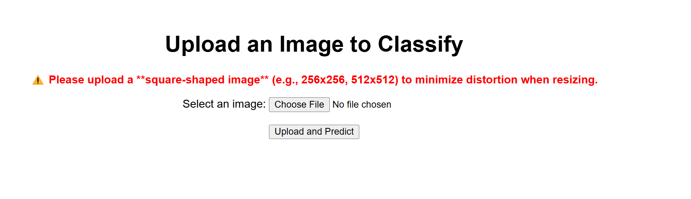

# **AI vs Human classification**
## **Project 4**: AI Generated vs Human Image Detection

## **Table of Contents**
- [**ai\_vs\_human**](#ai_vs_human)
  - [**Project 4**: AI Generated vs Human Image Detection](#project-4-ai-generated-vs-human-image-detection)
  - [**Table of Contents**](#table-of-contents)
  - [**Objective**](#objective)
  - [**Team Members**](#team-members)
  - [**Dataset**](#dataset)
  - [**Technologies / Dependencies Needed and Used**](#technologies--dependencies-needed-and-used)
  - [**Installation**](#installation)
  - [**Visualizations**](#visualizations)
  - [**Sources**](#sources)
  - [**Links**](#links)
  - [**License**](#license)
  

## **Objective**
This project aims to build a supervised learning model that can identify whether an image was generated by artificial intelligence or created by a human. We use a dataset from Kaggle and deployed our model using Flask.

## **Team Members**

- Jacob
- Lannon
- Matt
- Maxwell
- Toka
- Toni

## **Dataset**

We're using [datasets/alessandrasala79/ai-vs-human-generated-dataset](https://www.kaggle.com/datasets/alessandrasala79/ai-vs-human-generated-dataset?resource=download) from Kaggle, which contains AI-generated images and human-created images

Due to size limitations, the dataset is not stored directly in this repository. See the "Installation" section for instructions on how to obtain and set up the dataset

## **Technologies / Dependencies Needed and Used**
- **Python**: 3.10.15 - The programming language used for the project.
- **matplotlib**: A popular Python library for creating static, animated, and interactive visualizations. Used for plotting graphs, charts, and **visualizing model performance** in the project.

- **pandas**:  A powerful data analysis and manipulation library. Used for handling, cleaning, and transforming datasets efficiently.
- **os**: A built-in Python module for interacting with the operating system. Used for file and directory operations, such as reading and managing paths.
- **numpy**: A fundamental package for numerical computing in Python. Used for handling arrays, mathematical operations, and efficient data processing. **(Version: 1.26.4)**
- **TensorFlow/Keras**: A deep learning framework used for building and training convolutional neural networks (CNNs). Includes modules for model architecture (Sequential, models), layers (Conv2D, MaxPooling2D, Flatten, Dense), dataset handling (image_dataset_from_directory), and pretrained models (Xception for transfer learning). **(Version: 2.19.0)**
- **Flask**: A lightweight web framework in Python used for creating web applications and APIs. In deep learning projects, it's often used to build RESTful APIs for serving trained models, handling image uploads, and returning predictions to users through a web interface. **(Version: 3.0.3)**
- **gunicorn**: A Python WSGI HTTP server for UNIX. It's used to serve Flask applications in a production environment, providing better performance and scalability compared to the built-in Flask server. **(Version: 23.0.0)**
- **pillow**: A Python Imaging Library (PIL) fork that adds image processing capabilities to your Python interpreter. Used for opening, manipulating, and saving various image file formats, particularly useful for preprocessing images before feeding them into a model. **(Version: 10.4.0)**
- **boto3**: The Amazon Web Services (AWS) SDK for Python. It allows Python developers to write software that makes use of services like Amazon S3 and Amazon SageMaker, facilitating data storage and model deployment. **(Version: 1.34.71)**
- **python-dotenv**: A library that reads key-value pairs from a .env file and adds them to the environment variables. This is useful for managing configuration settings, such as API keys or database URLs, without hardcoding them into your application. **(Version: 1.0.1)**
- **werkzeug**: A comprehensive WSGI web application library. It is used by Flask and provides utilities for building web applications, including request and response handling, routing, and debugging. **(Version: 3.0.3)**
- **AWS S3**: Amazon Web Services' Simple Storage Service (S3) is used for storing and retrieving large amounts of static files, such as images, videos, or dataset backups. It integrates with your app to manage media or file uploads.
- **HEROKU**: A cloud platform for deploying and managing applications. It supports multiple programming languages and simplifies deployment pipelines, scaling, and configuration via CLI or dashboard.

## **Installation**
1. Clone the repository
2. Download the entire data file from [datasets/alessandrasala79/ai-vs-human-generated-dataset](https://www.kaggle.com/datasets/alessandrasala79/ai-vs-human-generated-dataset?resource=download)
3. Create a Resources folder
    - Upload the test.csv and train.csv here
    - Upload the train_data folder here and rename it to TrainingImages
4. Run the image_classifier.ipynb (This will take a few hours)
5. Use the model_03.h5 model to test the data
6. To test user images go to [User Flask Interface ](https://app-flask-xception-7d7b178928d0.herokuapp.com/)

## **Visualizations**
  

**Figure 1:** Screenshot of the Flask web interface used for image upload and prediction.  

  

  

**Figure 2:** Known AI image 1  

  

  

**Figure 3:** Known AI image 2

  

  

**Figure 4:** Known Human image 1

   

  

**Figure 5:** Known Human image 2

   

## **Sources**
- [Kaggle ai-vs-human-generated-dataset](https://www.kaggle.com/datasets/alessandrasala79/ai-vs-human-generated-dataset?resource=download) 
- Office Hours
- Documentation from [**Technologies / Dependencies Needed and Used**](#technologies--dependencies-needed-and-used)
- Tutor Sessions
- Xpert Learning Assistant
- ChatGPT
- Google

## **Links**
[User Flask Interface 📡](https://app-flask-xception-7d7b178928d0.herokuapp.com/)  
[matplotlib](https://matplotlib.org/)  
[pandas](https://pandas.pydata.org/)  
[numpy](https://numpy.org/doc/stable/user/quickstart.html)  
[TensorFlow/Keras](https://www.tensorflow.org/guide/keras)  
[Flask](https://flask.palletsprojects.com/en/stable/) 

## **License**
-  [GNU GENERAL PUBLIC LICENSE Version 3, 29 June 2007](./LICENSE) - see the LICENSE file for details here.
 

